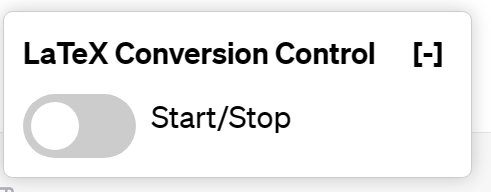
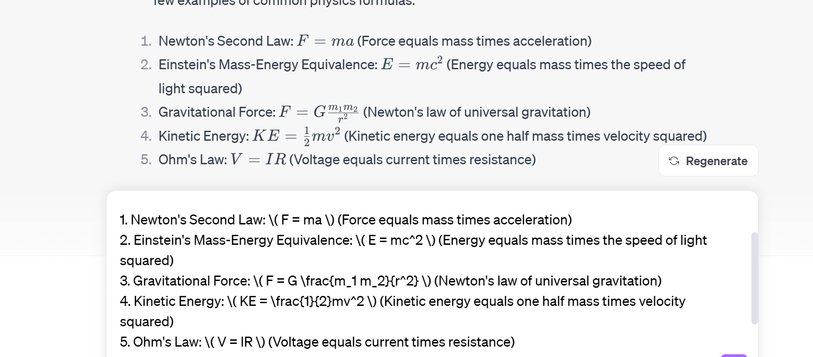
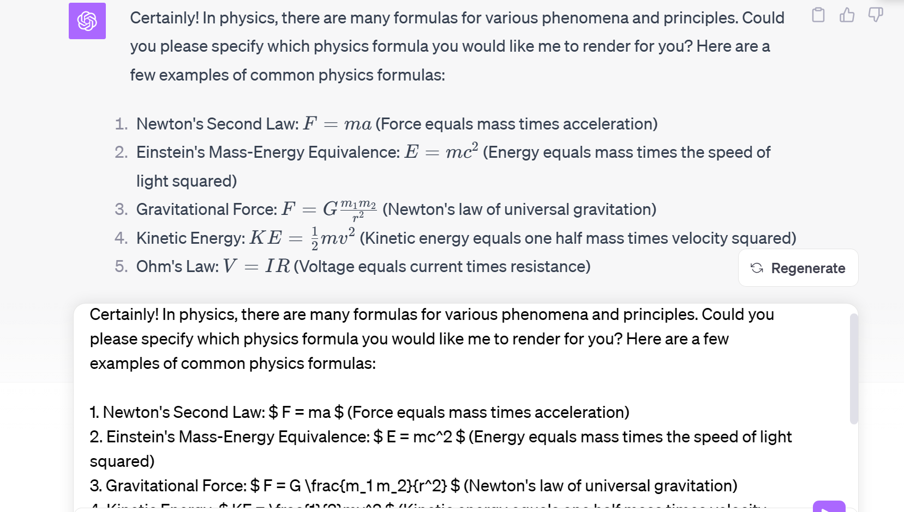

# ChatGPT-Latex
This project aims to implement the functionality that interact with the LaTex when using ChatGPT.  

## Principle

> The ChatGPT web version will conver the \$ into \\( and \\) and $$ into \\[  \\] for convenience, 
> but we need to transform it back when using the `Typroa`(such markdown render).
- Find the copy button in each response.
- Inject the copy button (how? change its copy logic change its output).
- Finished.

## Functionality

---

- Before :

- After:

## Download link

official channel✅:

| index | UserScript Source                                            | Appendix |
| ----- | ------------------------------------------------------------ | -------- |
| 1     | [Github](https://github.com/linkedlist771/ChatGPT-Latex)     | ✅        |
| 2     | [🚀🚀LatexForChatGPT🚀🚀 (greasyfork.org)](https://greasyfork.org/en/scripts/479009-latexforchatgpt) | ✅        |

